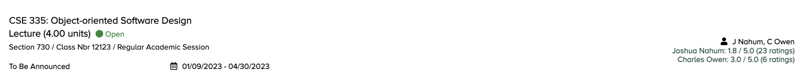

<picture>
  <source media="(prefers-color-scheme: dark)" srcset="images/logo-light.png" width="99">
  <source media="(prefers-color-scheme: light)" srcset="images/logo-dark.png" width="99">
  
</picture>

# Rate My University Professors

An open-source chrome extension. You can use it to quickly check professors' ratings from Rate My Professors on your university's course registration webpage.

Rate My University Professors currently supports Michigan State University and Wayne State University only.

## Screenshots

## Installation

1. Download this repo as a [ZIP file from GitHub](https://github.com/AdvaitPaliwal/rate-my-university-professors/archive/refs/heads/main.zip).
2. Unzip the file and you should have a folder named `rate-my-university-professors-main`.
3. Go to the extensions page (`chrome://extensions`).
4. Enable Developer Mode.
5. Drag the `rate-my-university-professors-main` folder anywhere on the page to import it (do not delete the folder afterwards).

## Usage

- Pin and click the extension icon when you're on your registration page to activate the ratings.
- Click again to deactivate it.

## Notes

- Reinstall the extension after any new commits.
- Works for Google Chrome or Chromium based browsers only.
